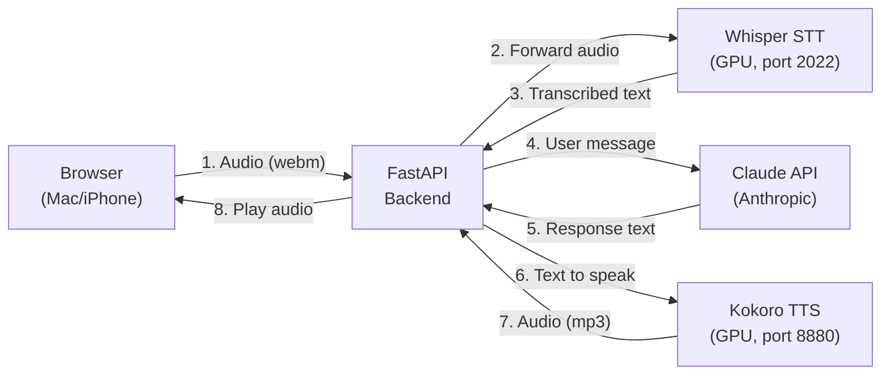
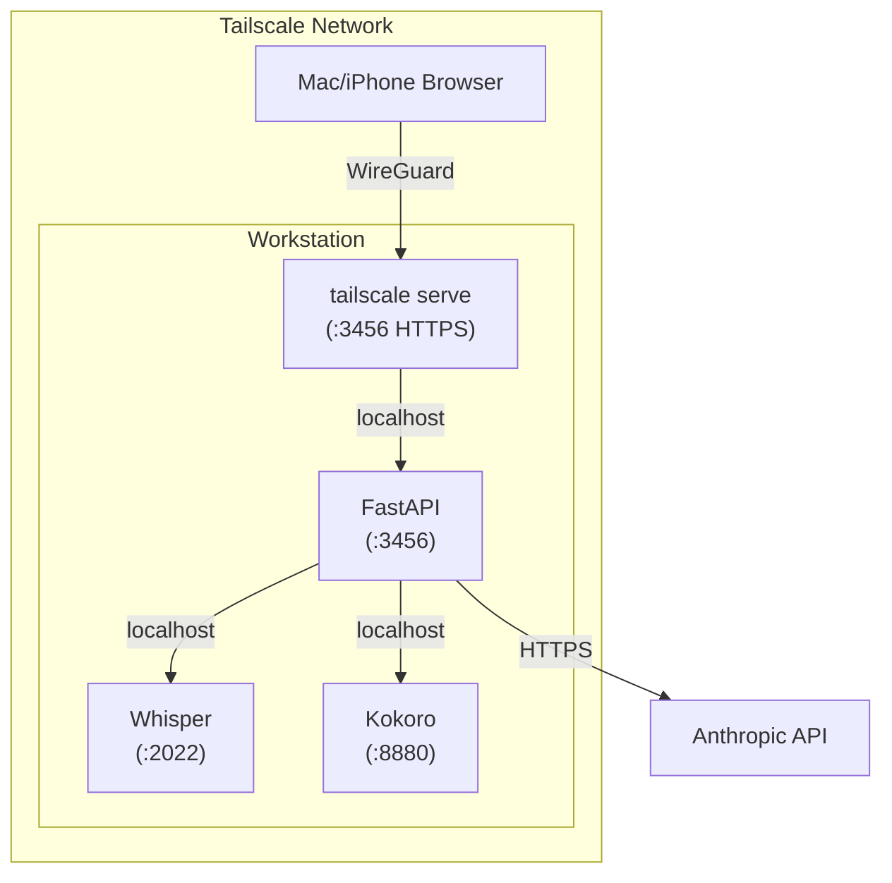

# Architecture

## Overview

Voice Chat is a self-hosted web application that connects a browser-based voice interface to Claude via local speech services. All processing stays on your network — no audio leaves your tailnet.

## Components

### Browser (Client)

The frontend is a single HTML page with vanilla JavaScript. It uses the [MediaRecorder API](https://developer.mozilla.org/en-US/docs/Web/API/MediaRecorder) to capture microphone audio as WebM/Opus, sends it to the backend, and plays back MP3 responses.

### FastAPI Backend

A lightweight Python server with four endpoints:

| Endpoint | Method | Purpose |
|----------|--------|---------|
| `/` | GET | Serve the web UI |
| `/api/transcribe` | POST | Forward audio to Whisper STT |
| `/api/chat` | POST | Send text to Claude, get response |
| `/api/speak` | POST | Forward text to Kokoro TTS |

The backend acts as a proxy — it doesn't process audio itself. This keeps the browser isolated from the local services and avoids CORS issues.

### Whisper STT

[whisper.cpp](https://github.com/ggerganov/whisper.cpp) running as an OpenAI-compatible server on the GPU. Accepts audio via `POST /v1/audio/transcriptions` and returns transcribed text.

### Kokoro TTS

[Kokoro](https://github.com/remsky/Kokoro-FastAPI) running as an OpenAI-compatible server on the GPU. Accepts text via `POST /v1/audio/speech` and returns synthesized audio.

### Claude API

The [Anthropic API](https://docs.anthropic.com/) provides the language model. The backend sends conversation history and receives responses. The system prompt is optimized for spoken responses — short, conversational, no markdown formatting.

## Network

All traffic between the browser and backend flows over Tailscale's WireGuard tunnel. The backend communicates with local services on `127.0.0.1`. No ports are exposed to the public internet.

