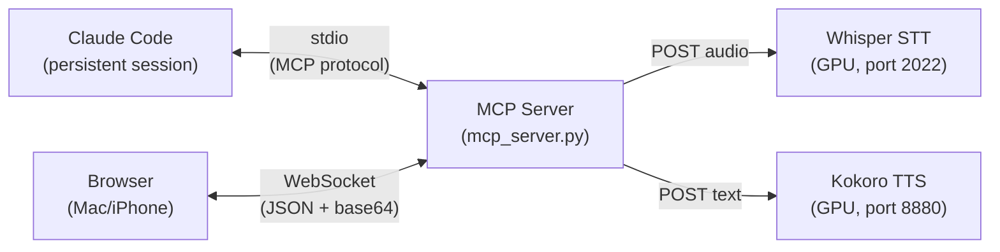
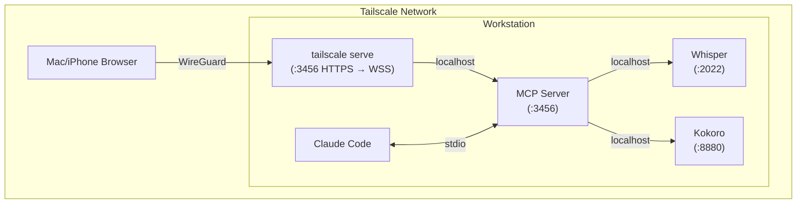

# Architecture

## Overview

Voice Chat is an MCP server that bridges browser audio with a persistent Claude Code session. Claude calls a `converse()` tool to speak and listen — audio flows between the browser and server over WebSocket, with local Whisper STT and Kokoro TTS handling speech processing. All audio stays on your network.

## How It Works

1. Claude Code launches the MCP server as a child process (stdio transport)
2. The MCP server also starts a WebSocket server on `:3456` (via FastMCP lifespan)
3. Browser connects via WebSocket through Tailscale HTTPS proxy
4. Claude calls `converse("Hello!")` — the MCP tool:
    - Sends text to Kokoro TTS → gets MP3 audio
    - Sends MP3 to browser via WebSocket
    - Browser plays audio → signals `playback_done`
    - Browser starts recording → sends WebM audio back
    - MCP server sends WebM to Whisper STT → gets text
    - Returns transcribed text to Claude
5. Claude processes the request, calls `converse()` again — loop continues

## Components

### MCP Server (`mcp_server.py`)

A single-process server with two transports:

- **FastMCP stdio** — communicates with Claude Code using the MCP protocol over stdin/stdout
- **FastAPI + WebSocket** — serves the web UI and handles real-time audio exchange with the browser

Key parts:

| Component | Purpose |
|-----------|---------|
| `Bridge` dataclass | Shared state: WebSocket ref, audio queue, sync events |
| `converse()` tool | TTS → send audio → wait for recording → STT → return text |
| `voice_chat_status()` tool | Check if browser is connected |
| FastAPI `/` | Serve `static/index.html` |
| FastAPI `/ws` | WebSocket endpoint for browser |

### Browser Client (`static/index.html`)

Single HTML page with vanilla JavaScript. Connects via WebSocket and handles:

- Playing received MP3 audio
- Recording microphone audio as WebM/Opus
- Auto-recording when server sends `listening` signal
- Tap-to-toggle mic for manual recording
- Connection status indicator

### Whisper STT

[whisper.cpp](https://github.com/ggerganov/whisper.cpp) running as an OpenAI-compatible server on the GPU. Accepts audio via `POST /v1/audio/transcriptions` and returns transcribed text.

### Kokoro TTS

[Kokoro](https://github.com/remsky/Kokoro-FastAPI) running as an OpenAI-compatible server on the GPU. Accepts text via `POST /v1/audio/speech` and returns synthesized audio.

## WebSocket Protocol

### Server → Browser

| Message | Purpose |
|---------|---------|
| `{"type": "audio", "data": "<base64 mp3>"}` | TTS audio to play |
| `{"type": "listening"}` | Start recording |
| `{"type": "status", "text": "..."}` | UI status update |
| `{"type": "done"}` | Turn complete |

### Browser → Server

| Message | Purpose |
|---------|---------|
| `{"type": "audio", "data": "<base64 webm>"}` | Recorded audio |
| `{"type": "playback_done"}` | Finished playing TTS audio |

## Network

All traffic between the browser and server flows over Tailscale's WireGuard tunnel. The server communicates with local services on `127.0.0.1`. No ports are exposed to the public internet.

